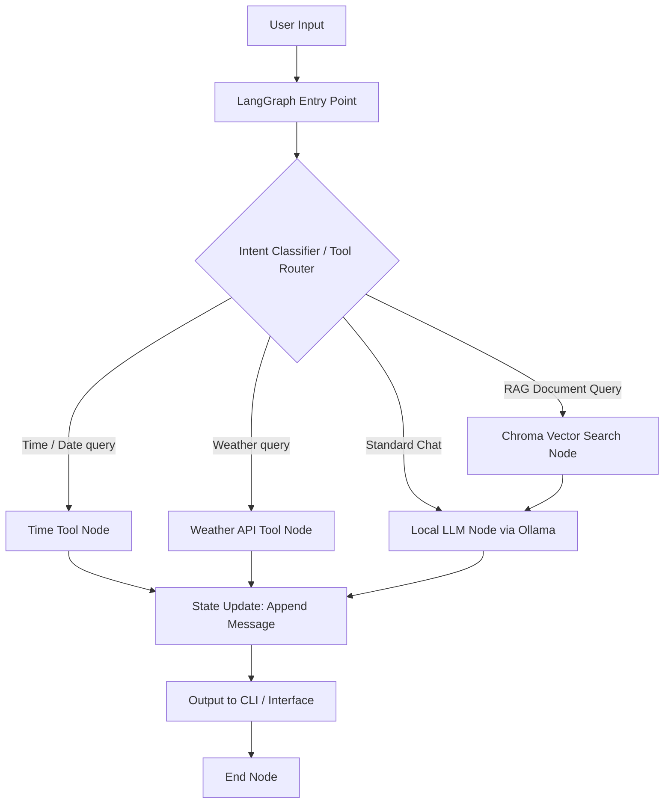

# 🤖 Autonomous Local AI Chatbot Orchestrator

A privacy-first, fully offline conversational AI assistant and RAG (Retrieval-Augmented Generation) agent built in **Python** using **LangGraph**, **LangChain**, **Ollama**, and **ChromaDB**. 

This application runs entirely on local compute, allowing users to query private documents (PDFs, spreadsheets) and execute agentic tool workflows without transmitting data to external third-party cloud APIs.

---

## 🚀 Key Features

*   **Offline Local LLM:** Integrates with local language models (such as `mistral`, `llama3`, `phi3`) executed via Ollama, eliminating external API costs and security concerns.
*   **LangGraph-Driven State Management:** Orchestrates conversations using a finite-state machine graph to handle conditional routing, memory tracking, and agentic workflows.
*   **Function-Calling & Tool Execution:** Includes conditional node routing to resolve specific requests (e.g., date/time retrieval, live weather updates, spreadsheet lookups) prior to passing contexts to the LLM.
*   **Document Retrieval Pipeline (RAG):** Pre-equipped with integrations for PyPDF, Pandas/OpenPyXL, SentenceTransformers, and Chroma vector databases to ingest, chunk, embed, and index private files for contextual search.
*   **Memory-Preserved Multi-Turn Chat:** Implements full message history tracking within the graph state to ensure context is retained across conversational turns.

---

## 🧠 Workflow Architecture

The application routes conversational inputs based on detected intent:



---

## 🛠️ Technology Stack

*   **Orchestration:** LangGraph (StateGraph architecture)
*   **Chaining & Prompts:** LangChain, LangChain-Community
*   **Inference Engine:** [Ollama](https://ollama.com) (Default local model: `mistral`)
*   **Vector Database:** ChromaDB
*   **Embeddings:** SentenceTransformers (Local HuggingFace embeddings)
*   **Document Parsers:** PyPDF (for PDFs), Pandas & OpenPyXL (for XLSX datasets)

---

## ⚙️ Setup and Installation

### 1. Prerequisites
*   Python 3.10 or higher
*   Ollama installed locally

### 2. Download and Start the Local LLM
Install Ollama and pull your model of choice (e.g., Mistral):
```bash
# Pull the default model
ollama pull mistral
```
Ensure that the Ollama service is running on your background.

### 3. Install Dependencies
```bash
pip install -r requirements.txt
```

### 4. Running the Chatbot
Launch the terminal-based interactive agent:
```bash
python app.py
```

---

## 🛡️ License

Distributed under the MIT License. See `LICENSE` for more information.
